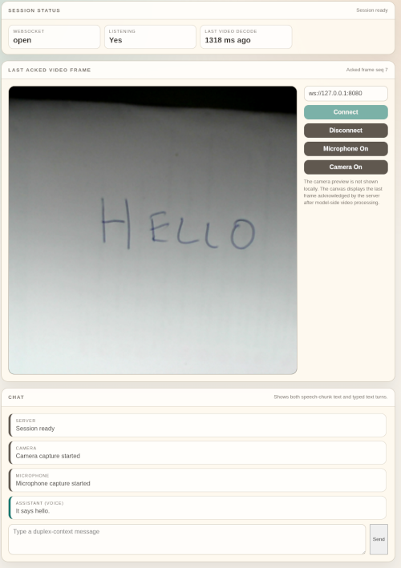

# llama-omni-server

## What

C++23 WebSocket server (and sample single-page index.html client) for local execution of the
[MiniCPM-o 4.5](https://github.com/OpenBMB/MiniCPM-o) speech-to-speech full-duplex multimodal model
on modest (16GB VRAM) hardware.

Supports streamed audio (speech) and video frame input and generates spoken output with integrated
TTS. Also supports typed text turns.

Additionally, bundles a utility to generate voice clones for use by the model.



## Why

The OpenBMB MiniCPM-o 4.5 model has a very interesting architecture. Not only can quantized
versions run real-time locally on modest hardware (16GB VRAM with minimal CPU offload), but it is a
rare speech-to-speech multimodal model. This means it processes input audio directly - no
speech-to-text step first; and outputs speech directly by using hidden state as well as the text
output of the model, allowing "emotion" to be conveyed. In addition it has extremely good vision
understanding.

However, at the time of writing, the official tooling around the model has serious limitations.

The best-written client/runtime is the official
[minicpm-o-4_5-pytorch-simple-demo](https://github.com/OpenBMB/MiniCPM-o-Demo) that uses the
HuggingFace [transformers](https://github.com/huggingface/transformers) library. However, this
solution does not support CPU offloading making 16GB VRAM setups out of reach. Additionally, the
AWQ quantization available for this model is broken; but even after creating a custom AWQ
quantization to fix this, the model(s) still does not _quite_ fit on 16GB VRAM.

An alternative that does support CPU offloading (and therefore allows the model to run on 16GB
VRAM) is the [llama.cpp-omni](https://github.com/tc-mb/llama.cpp-omni) fork of
[llama.cpp](https://github.com/ggml-org/llama.cpp). This has two main problems:

- It is a fork of llama.cpp and so you need to check out and build this repo (and have a separate
  complex client runtime), rather than directly using the official llama.cpp package.
- The code to support MiniCPM-o 4.5 is rather... messy, containing bugs that are hard to fix due to
  the spaghetti nature of the original code.

It is the last point that inspired this project. Given the difficulty of contributing fixes to the
upstream codebase, it seemed a great opportunity to create something new and experiment with the
cutting edge of C++ and LLM software development, using entirely local hardware.

## How

Uses llama.cpp as a library to execute the model(s).
[Boost.Beast](https://www.boost.org/doc/libs/latest/libs/beast/doc/html/index.html) is used for
WebSockets, with messages structured using [MessagePack](https://msgpack.org/) for binary field
support. The C++23 code is structured to heavily use C++20+ coroutines via
[Boost.Cobalt](https://www.boost.org/library/latest/cobalt/). Only two CPU threads are used in
application code - one to (asynchronously) manage the server and session, and one to execute the
model on the GPU in parallel, allowing further session processing to continue.

The model is able to run on official llama.cpp (rather than the llama.cpp-omni fork) by requiring
the TTS model to be split into two parts via the bundled
[split_tts_gguf.py](utils/split_tts_gguf.py) utility. Without this, model loading fails.

Context overflow is handled using a sliding window approach.

One of the issues in the upstream llama.cpp-omni implementation is that text can be generated much
faster than the speech audio plays, breaking natural conversation.

To solve this, backpressure is applied to keep the speech audio roughly in sync with new token
generation, with a small allowance to avoid long pauses between speech chunks. That is, speech
generation speed is throttled by acknowledgements from the client that previous speech has been
played.

If there is a backlog of spoken voice, the server may temporarily stop listening to user speech, to
avoid overwhelming the model when generation resumes (this status is indicated in the `index.html`
client).

## Running

### Dependencies

* [MiniCPM-o 4.5 gguf model set](https://huggingface.co/openbmb/MiniCPM-o-4_5-gguf)
* Split TTS model using [utils/split_tts_gguf.py](utils/split_tts_gguf.py) - see
  [Model directory layout](#model-directory-layout) below.
* (Optional) WAV file for voice to clone. Generate custom prompt cache using
  [gen_prompt_cache.py](utils/gen_prompt_cache.py) and specify both the WAV and the generated
  prompt cache in the YAML config (`reference_prompt_cache` and `reference_wav`).

### Configuration

The server is configured via a YAML file passed as the first argument. The `config.example.yaml`
file in the repo root documents all available settings and serves as the default config for
integration tests.

All paths in the config file are resolved relative to the config file's location.

### Running the server

```bash
omni_server config.example.yaml
```

The server listens on the port configured in the YAML file (default `8080`). It accepts one
WebSocket connection at a time. A second connection attempt while a session is active is rejected
with an `error` frame.

An example browser client is available as a single `index.html`.

### Model directory layout

> **Warning**
>
> Note that the (sub-)model structure doesn't _quite_ match the upstream structure. In particular,
> the `MiniCPM-o-4_5-tts-F16.gguf` file has been split into `transformers` and `weights`. This
> allows the model(s) to be loaded by the official `llama.cpp` library, rather than requiring the
> custom `llama.cpp-omni` fork. A utility to split the upstream model is available at
> [utils/split_tts_gguf.py](utils/split_tts_gguf.py).

Note that the exact filenames depend on the chosen quantization:

```
  MiniCPM-o-4_5-Q4_K_M.gguf          main LLM
  vision/
    MiniCPM-o-4_5-vision-F16.gguf    CLIP vision encoder
  audio/
    MiniCPM-o-4_5-audio-F16.gguf     Whisper audio encoder
  tts/
    MiniCPM-o-4_5-projector-F16.gguf
    MiniCPM-o-4_5-tts-transformer-F16.gguf
    MiniCPM-o-4_5-tts-weights-F16.gguf
  token2wav-gguf/                     Token2Wav vocoder (encoder, flow, hifigan GGUFs)
    prompt_cache.gguf                 default voice prompt cache
```

### Limitations

The project is currently set up to run a single session locally on a single machine and has only
been tested on Linux (NixOS 25.11 with GCC 15.2).

Many model hyperparameters are configurable via the YAML config file and the defaults (as in
`config.example.yaml`), whilst being a good starting point, are very likely suboptimal.

There is currently no handling of CORS requests, so the server must be run on the same origin as
the client.

## Building

Build dependencies are managed via [Conan](https://conan.io/), which also creates CMake presets
for the build:

```bash
conan install . -of build --build=missing
cmake --preset conan-release
cmake --build --parallel --preset conan-release
```

## Development

Debug builds additionally enable [Clang-Tidy](https://clang.llvm.org/extra/clang-tidy/) integration
(where available) and are recommended for development (especially useful for AI coding
assistants!).

The following assumes a chosen build directory of `build`.

Configure:

```bash
conan install . -of build --build=missing -s "&:build_type=Debug"
cmake --preset conan-debug -DLLAMAOMNISERVER_ENABLE_TESTS=ON
```

Build:

```bash
cmake --build --parallel --preset conan-debug
```

Test:

Configure the root `config.example.yaml`, then

```bash
ctest --test-dir build --output-on-failure --timeout 300
```

### CMake variables

| Variable                             | Purpose                                                                                                                  |
|--------------------------------------|--------------------------------------------------------------------------------------------------------------------------|
| `LLAMAOMNISERVER_ENABLE_TESTS`       | Set to `ON` to build the test suite (default: `OFF`).                                                                    |
| `LLAMAOMNISERVER_ENABLE_TEST_VENDOR` | Set to `ON` to build the exploratory vendor integration tests.                                                           |
| `LLAMAOMNISERVER_MODEL_ROOT`         | For vendor tests - directory containing the GGUF model files (parent of `vision/`, `audio/`, `tts/`, `token2wav-gguf/`). |


`LLAMAOMNISERVER_MODEL_ROOT` is only required if `LLAMAOMNISERVER_ENABLE_TEST_VENDOR` is
enabled. Other tests make use of the `config.example.yaml` config file.

The `LLAMAOMNISERVER_ENABLE_TEST_VENDOR` tests were developed prior to the main codebase to gain
an understanding of the model and can be left disabled. They remain for historical purposes.

### Environment variables

CTest injects the following environment variables into test processes automatically
from the CMake variables above. You do not need to set them manually when using
`ctest`.

| Variable                         | Set from CMake variable      | 
|----------------------------------|------------------------------|
| `LLAMAOMNISERVER_MODEL_ROOT`     | `LLAMAOMNISERVER_MODEL_ROOT` |
| `LLAMAOMNISERVER_TEST_REPO_ROOT` | `CMAKE_SOURCE_DIR`           |

### Wire protocol

All WebSocket messages are binary MessagePack maps with a `"type"` string field.

See [index.html](index.html) for reference client implementation.

### Generating a voice prompt cache

The same WAV file that generated the cache *must* be set in the `voice.reference_wav` option in
the YAML configuration file, as well as the generated prompt cache file in the
`voice.reference_prompt_cache` option.

See the [gen_prompt_cache.py](utils/gen_prompt_cache.py) utility for details of how to use that
tool to generate a prompt cache from a reference WAV file.

## AI coding assistant statement

Coding assistants were used extensively, but all code was reviewed, and most code further edited,
by a human.

The only substantive code virtually untouched by a human is the `index.html` client and
the `gen_prompt_cache.py` and `split_tts_gguf.py` utilities. This README was almost entirely
written by a human.

An `AGENTS.md` is not included in the repo due to the need to refer to many directories outside
the repo for reference purposes (e.g. upstream sources).

This project was in part embarked upon as an opportunity to experiment with AI coding assistants.
[Claude Code](https://www.anthropic.com/product/claude-code) with Sonnet 4.6 and Opus 4.6 was used
initially to help detangle and understand the spaghetti code in the llama.cpp-omni codebase, and
is subsequently used sporadically throughout development.
[OpenAI Codex](https://openai.com/codex/) with GPT 4.5 was used extensively in the mid-current
stages of development. [OpenCode](https://opencode.ai/) with Z.Ai's
[GLM 4.7 Flash](https://huggingface.co/zai-org/GLM-4.7-Flash) model running locally via llama.cpp
was attempted but proved unfruitful. Finally, some minor work was accomplished in late stages using
[Qwen Code](https://qwen.ai/qwencode) with the default (at time of writing) Qwen 3.6 Plus model.

### A note on commit history

Due to the meandering and experimental nature of the project in initial stages, as well as the
initial inclusion of minor personal information (e.g. absolute paths) in the project, the commit
history was squashed into a single commit once the project reached a level of stability.

## License

MIT (follows llama.cpp).
